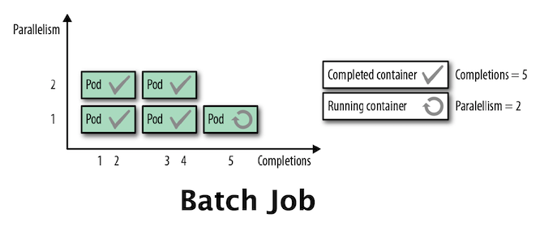

# `CronJob`, `Job`



_출처: [Kubernetes Patterns](https://developers.redhat.com/blog/2020/05/11/top-10-must-know-kubernetes-design-patterns/) - Red Hat_

## Kubernetes [Workloads](https://kubernetes.io/ko/docs/concepts/workloads/)

- [Workloads](https://kubernetes.io/ko/docs/concepts/workloads/) - Kubernetes Docs
- `Job` 및 `CronJob`은 실행 완료 후 중단되는 작업을 정의한다.
- `CronJob`이 스케줄에 따라 반복되는 반면, `Job`은 단 한 번의 작업을 나타낸다.
- `Job`도 `Pod`를 생성하고 관리하는 컨트롤러의 역할을 한다.
- `CronJob`은 `Job`을 Unix 시스템의 cron 형식처럼 주기적으로 동작시킨다.
- `CronJob` 오브젝트는 crontab (cron table) 파일의 한 줄과 같다.

## `Job` 정리

- [Clean up finished jobs automatically](https://kubernetes.io/docs/concepts/workloads/controllers/job/#clean-up-finished-jobs-automatically) - Kubernetes Docs
- 프로세스가 종료되면 `CronJob`이 생성한 `Pod`는 `Completed` 상태가 되는데 최대 5개만 표시가 된다.
- 완료된 `Job`은 일반적으로 시스템에서 더 이상 필요로 하지 않는다. 시스템 내에 이를 유지한다면 API 서버에 부담이 된다.
- 만약 `CronJob`과 같은 상위 레벨 컨트롤러가 `Job`을 직접 관리하는 경우, 지정된 용량 기반 정리 정책에 따라 `CronJob`이 `Job`을 정리할 수 있다.
- TTL 컨트롤러는 `Job`을 계단식으로 삭제한다. 즉, `Job`과 함께 `Pod`와 같은 종속 오브젝트를 삭제한다.
- `Job`을 삭제하면 finalizer와 같은 라이프사이클 보증이 보장되는 것을 참고한다.

```yaml
apiVersion: batch/v1
kind: Job
metadata:
  name: pi-with-ttl
spec:
  ttlSecondsAfterFinished: 100
  template:
    spec:
      containers:
        - name: pi
          image: perl
          command: ["perl", "-Mbignum=bpi", "-wle", "print bpi(2000)"]
      restartPolicy: Never
```
