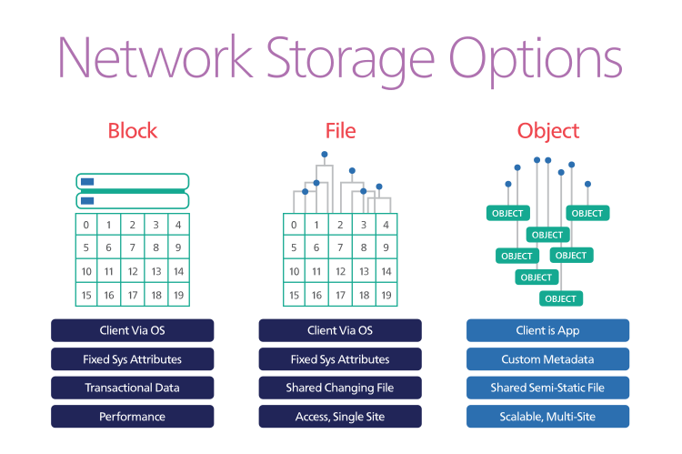
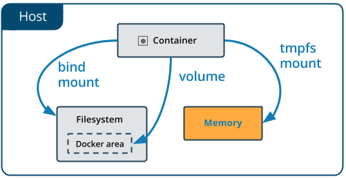
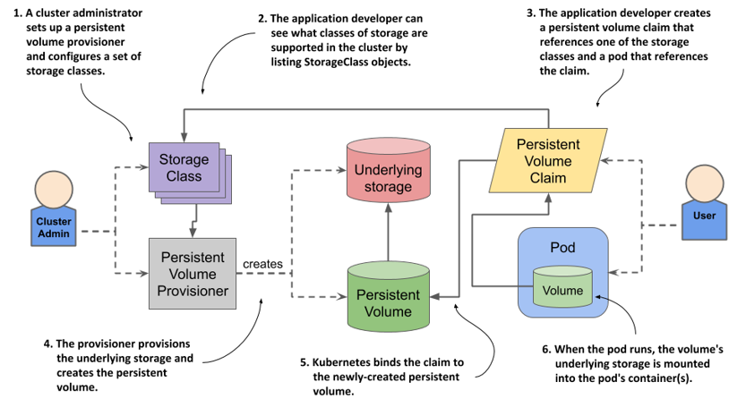

# 컨테이너 스토리지 톺아보기

- [컨테이너 스토리지 톺아보기](#컨테이너-스토리지-톺아보기)
  - [참고 자료](#참고-자료)
  - [스토리지 관련 용어](#스토리지-관련-용어)
  - [스토리지 유형](#스토리지-유형)
    - [파일 스토리지](#파일-스토리지)
    - [블록 스토리지](#블록-스토리지)
    - [오브젝트 스토리지](#오브젝트-스토리지)
  - [Docker (Container) Storage](#docker-container-storage)
    - [Storage Driver](#storage-driver)
    - [Union Mount](#union-mount)
  - [Kubernetes Storage API](#kubernetes-storage-api)
    - [Volume](#volume)
    - [PersistentVolume (PV)](#persistentvolume-pv)
    - [PersistentVolumeClaim (PVC)](#persistentvolumeclaim-pvc)
    - [StorageClass (SC)](#storageclass-sc)
    - [Container Storage Interface (CSI)](#container-storage-interface-csi)
    - [ReplicaSet과의 관계](#replicaset과의-관계)

## 참고 자료

- [정보 스토리지와 관리](http://www.acornpub.co.kr/book/information-storage) - EMC Education Services
  - [What are the different types of storage: block, object and file?](https://ubuntu.com/blog/what-are-the-different-types-of-storage-block-object-and-file) - Ubuntu
  - [Volume vs. Partition](https://www.alphr.com/volume-vs-partition/)
  - [An Introduction to LVM Concepts, Terminology, and Operations](https://www.digitalocean.com/community/tutorials/an-introduction-to-lvm-concepts-terminology-and-operations)
  - [스토리지 기술](http://www.ktword.co.kr/abbr_view.php?m_temp1=3113) - 정보통신기술용어해설, 차재복
- [쿠버네티스 인 액션 1/E](http://www.acornpub.co.kr/book/k8s-in-action-new) - 마르코 룩샤
  - [Understanding persistent storage](https://docs.openshift.com/container-platform/latest/storage/understanding-persistent-storage.html) - Red Hat OpenShift
  - [Storage Patterns for Kubernetes For Dummies](https://www.redhat.com/cms/managed-files/st-storage-patterns-kubernetes-dummies-ebook-f20626-201911-en.pdf) - Red Hat
  - [Kubernetes Storage: Dynamic Volumes and the Container Storage Interface](https://platform9.com/blog/kubernetes-storage-dynamic-volumes-and-the-container-storage-interface/) - Platform9
  - [Getting Started with Kubernetes | Storage Architecture and Plug-ins](https://www.alibabacloud.com/blog/getting-started-with-kubernetes-%7C-storage-architecture-and-plug-ins_596307) - Kan Junbao
  - [What Is Kubernetes Storage? How Persistent Storage Works](https://www.enterprisestorageforum.com/cloud/kubernetes-storage/) - Sean Michael Kerner
  - [Introduction to Kubernetes Storage and NVMe-oF Support](https://01.org/kubernetes/blogs/qwang10/2019/introduction-kubernetes-storage-and-nvme-support) - Shane Wang
- [CSI](https://github.com/kodekloudhub/certified-kubernetes-administrator-course/blob/master/docs/08-Storage/05-Container.Storage-Interface.md) - KodeKloud
  - [Container Storage Interface (CSI) for Kubernetes GA](https://kubernetes.io/blog/2019/01/15/container-storage-interface-ga/)
  - [CSI Driver List](https://kubernetes-csi.github.io/docs/drivers.html)
  - [CSI NFS Driver](https://github.com/kubernetes-csi/csi-driver-nfs)

## 스토리지 관련 용어

- [File System](http://doc.kldp.org/Translations/html/SysAdminGuide-KLDP/x1087.html):
  운영체제가 저장 장치에 파일을 어떻게 쓰고 읽을 것인지를 지정한 체계를 말합니다.
  즉, 파일들이 디스크상에서 구성되는 방식입니다.
  파일 시스템이라는 말은 파일을 저장하는 데 사용되는 파티션이나 디스크를 가리킬 때나,
  파일 시스템의 형식을 가리킬 때 사용되기도 합니다.
  대표적으로 `FAT32`, `NTFS`, `ext4` 등이 있습니다.
- [Storage](https://en.wikipedia.org/wiki/Computer_data_storage):
  디지털 데이터 저장 장치 그 자체를 스토리지 또는 스토리지 디바이스라고 합니다.
- Partition:
  하나의 물리 스토리지를 논리적으로 분할해 생성되는 공간입니다.
- [Volume](<https://en.wikipedia.org/wiki/Volume_(computing)>):
  컴퓨터가 사용하고 인식할 수 있는 특정 파일 시스템의 스토리지 컨테이너입니다.
  볼륨 또는 논리 드라이브(logical drive)는 하나의 파일 시스템을 갖춘 저장 영역입니다.
  일반적으로 하드 디스크의 단일 파티션에 상주합니다.
  주요 스토리지 볼륨 유형으로는 HD(Hard Drive), SSD(Solid State Drive), DVD, CD 등이 있습니다.
- [Logical Volume](https://www.ibm.com/docs/en/aix/7.1?topic=concepts-logical-volumes):
  하나의 연속된 디스크 볼륨으로 보이지만, 실제로는 비연속적인 물리 파티션 또는 두 개 이상의 물리적 볼륨에 상주하는 볼륨을 말합니다.

## 스토리지 유형

- [데이터 스토리지](https://www.redhat.com/ko/topics/data-storage) - Red Hat
  - [파일 스토리지, 블록 스토리지, 오브젝트 스토리지](https://www.redhat.com/ko/topics/data-storage/file-block-object-storage)
  - [`SDS`, Software Defined Storage](https://www.redhat.com/ko/topics/data-storage/software-defined-storage)
  - [`NAS`, Network attached Storage](https://www.redhat.com/ko/topics/data-storage/network-attached-storage)
  - [Cloud Storage](https://www.redhat.com/ko/topics/data-storage/what-is-cloud-storage)
- [파일 스토리지, 오브젝트 스토리지, 블록 스토리지의 차이](https://www.alibabacloud.com/ko/knowledge/difference-between-object-storage-file-storage-block-storage) - Alibaba Cloud



_출처: [What’s the Difference Between Block, File and Object-based Data Storage?](https://www.caringo.com/blog/back-basics-object-storage) - Caringo_

### 파일 스토리지

File storage는 데이터가 폴더 안에 단일 정보로 저장됩니다.
해당 데이터에 액세스해야 하는 경우, 컴퓨터는 그 데이터를 찾기 위해 경로를 알아야 합니다.
파일에 저장된 데이터는 제한된 양의 메타데이터(해당 파일 자체가 보관된 정확한 위치를 알려주는 데이터)를 사용해 구성 및 검색됩니다.

대표적으로 네트워크 연결 스토리지(`NAS`, Network attached Storage), 직접 연결 스토리지(`DAS`, Direct attached Storage)가 있습니다.

### 블록 스토리지

Block Storage는 데이터를 블록으로 쪼갭니다. 즉 데이터를 별도의 조각으로 분리해 저장하는 것입니다.
각 데이터 블록은 고유 식별자를 부여받는데, 이는 스토리지 시스템이 더 작은 데이터 조각을 원하는 곳에 배치할 수 있도록 해줍니다.
이는 일부 데이터는 Linux 환경에 저장하고 일부는 Windows 장치에 저장할 수 있다는 뜻입니다.

블록 스토리지는 데이터를 사용자의 환경에서 분리해 이를 쉽게 활용할 수 있도록 다양한 환경 전반에 분산하도록 설정되는 경우가 많습니다.
그런 후 데이터가 요청되면 기본 스토리지 소프트웨어가 이러한 환경의 데이터 블록을 다시 조합해 사용자에게 제공합니다.
이는 대체로 스토리지 영역 네트워크(`SAN`, Storage Area Network) 환경에 배포되며 가동되는 서버에 연결되어야 합니다.

블록 스토리지는 파일 스토리지와 같이 단일 데이터 경로에 의존하지 않으므로 신속하게 검색할 수 있습니다.
각 블록은 독립적으로 존재하며 파티션으로 분할될 수 있어, 서로 다른 운영 체제에 액세스할 수 있습니다.
대규모 데이터를 저장해야 할수록 블록 스토리지를 사용하는 것이 더 유리합니다.

블록 스토리지는 비용이 많이 들 수 있습니다.
메타데이터를 처리하는 기능이 제한적이므로, 애플리케이션 또는 데이터베이스 수준에서 취급해야 합니다.
그러면 개발자나 시스템 관리자의 업무 부담이 늘어나게 됩니다.

### 오브젝트 스토리지

Object Storage는 파일들이 작게 나뉘어 여러 하드웨어에 분산되는 평면적(flat) 구조입니다.
오브젝트 스토리지에서 데이터는 오브젝트라 불리는 개별 단위로 나뉘며, 서버의 블록이나 폴더에 파일을 보관하는 대신 단일 리포지토리에 보관됩니다.

오브젝트 스토리지 볼륨은 모듈 단위로 동작합니다.
각각은 독립적인 리포지토리이며 데이터, 오브젝트가 분산 시스템에 존재하도록 허용하는
고유 식별자, 그리고 해당 데이터를 설명하는 메타데이터를 보유합니다.

오브젝트 스토리지에는 단순한 HTTP API가 필요하며, 이는 대부분의 클라이언트에서 모든 언어로 사용됩니다.
오브젝트 스토리지는 사용한 만큼만 비용을 지불하면 되므로 비용 효율적입니다.
확장하기도 쉬우므로 퍼블릭 클라우드 스토리지에 매우 적합합니다.

오브젝트는 수정이 불가능합니다. 따라서 한번에 오브젝트 작성을 완료해야 합니다.
오브젝트 스토리지는 또한 전통적인 데이터베이스와 잘 연동되지 않습니다.
오브젝트 작성이 느리게 진행되는 데다가, 오브젝트 스토리지 API를 사용하기 위해 애플리케이션을 작성하는 일이 파일 스토리지를 사용할 때만큼 간단하지 않기 때문입니다.

## Docker (Container) Storage

- [Manage data in Docker](https://docs.docker.com/storage/) - Docker docs


_[Use volumes](https://docs.docker.com/storage/volumes/)_


_[Use bind mounts](https://docs.docker.com/storage/bind-mounts/)_



_[Use volumes](https://docs.docker.com/storage/volumes/)_

### Storage Driver

스토리지 드라이버를 사용하면 컨테이너의 writable layer에 데이터를 생성 할 수 있습니다.
컨테이너가 삭제 된 후에는 파일이 유지되지 않으며, 읽기-쓰기 속도가 기본 파일 시스템 성능보다 낮습니다.

- Docker 이미지는 일련의 레이어로 구성됩니다.
- 새 컨테이너를 만들 때 기본 레이어 위에 새로운 writable 레이어를 추가합니다.
  - 마지막 레이어를 제외한 각 레이어는 읽기 전용(Read only)입니다.
  - 컨테이너와 이미지의 주요 차이점 중 하나가 바로 쓰기 가능한 최상위 레이어입니다
- 각 레이어는 이전 레이어와의 차이점 집합으로 스택처럼 위로 쌓입니다.

```bash
docker ps --size
# CONTAINER ID   IMAGE                  COMMAND                  CREATED        STATUS        PORTS                    NAMES                                                                                                            SIZE
# 346d1681c453   50b52cdadbcf           "start_runit"            21 hours ago   Up 21 hours                            k8s_calico-node_calico-node-j4m95_kube-system_57ba2a18-63bf-4ac4-b801-b1427dff8c55_1                             9.41kB (virtual 172MB)
# 8671173097d0   5384b1650507           "/usr/local/bin/kube…"   21 hours ago   Up 21 hours                            k8s_kube-proxy_kube-proxy-wtvlc_kube-system_57b18527-b525-43d8-aaa0-ab54807f434b_3                               2.29kB (virtual 118MB)
# b9c83db77b35   k8s.gcr.io/pause:3.2   "/pause"                 21 hours ago   Up 21 hours                            k8s_POD_calico-node-j4m95_kube-system_57ba2a18-63bf-4ac4-b801-b1427dff8c55_1                                     0B (virtual 683kB)
# b922959f94b7   k8s.gcr.io/pause:3.2   "/pause"                 21 hours ago   Up 21 hours                            k8s_POD_kube-proxy-wtvlc_kube-system_57b18527-b525-43d8-aaa0-ab54807f434b_3                                      0B (virtual 683kB)
# 883c40d274dd   8d13f1db8bfb           "kube-scheduler --au…"   21 hours ago   Up 21 hours                            k8s_kube-scheduler_kube-scheduler-esxi05-vm11_kube-system_9e23b1a40191518b4ea2c75208418b49_4                     0B (virtual 47.3MB)
# 1b63285a824f   k8s.gcr.io/pause:3.2   "/pause"                 21 hours ago   Up 21 hours                            k8s_POD_kube-scheduler-esxi05-vm11_kube-system_9e23b1a40191518b4ea2c75208418b49_3                                0B (virtual 683kB)
# 22586ba60135   6f0c3da8c99e           "kube-controller-man…"   21 hours ago   Up 21 hours                            k8s_kube-controller-manager_kube-controller-manager-esxi05-vm11_kube-system_59bc3d063ec9555606a7713554e900b3_4   0B (virtual 116MB)
# 3fcba5260659   k8s.gcr.io/pause:3.2   "/pause"                 21 hours ago   Up 21 hours                            k8s_POD_kube-controller-manager-esxi05-vm11_kube-system_59bc3d063ec9555606a7713554e900b3_3                       0B (virtual 683kB)
# f9bce80f0db1   d7e24aeb3b10           "kube-apiserver --ad…"   21 hours ago   Up 21 hours                            k8s_kube-apiserver_kube-apiserver-esxi05-vm11_kube-system_0c9ee13920b1848a3488b19379e80a30_1                     0B (virtual 122MB)
# 67f908035c12   k8s.gcr.io/pause:3.2   "/pause"                 21 hours ago   Up 21 hours                            k8s_POD_kube-apiserver-esxi05-vm11_kube-system_0c9ee13920b1848a3488b19379e80a30_1                                0B (virtual 683kB)
# da488d7505fe   0369cf4303ff           "etcd --advertise-cl…"   21 hours ago   Up 21 hours                            k8s_etcd_etcd-esxi05-vm11_kube-system_a3dfe597eb629b72919dd3e95c31fc6d_3                                         0B (virtual 253MB)
# aa4e9f2638da   k8s.gcr.io/pause:3.2   "/pause"                 21 hours ago   Up 21 hours                            k8s_POD_etcd-esxi05-vm11_kube-system_a3dfe597eb629b72919dd3e95c31fc6d_3                                          0B (virtual 683kB)
# 68cb541dcfb5   registry:2.7.1         "/entrypoint.sh /etc…"   10 days ago    Up 21 hours   0.0.0.0:5000->5000/tcp   registry                                                                                                         2.88GB (virtual 2.9GB)
```

- `size`: 각 컨테이너의 Writable layer에 사용되는 데이터(on disk) 크기입니다.
- `virtual size`: 컨테이너에서 사용하는 R/O 이미지 데이터와 컨테이너의 Writable layer에 사용되는 데이터 크기.
- 총 디스크 사용량을 과대 평가하지 않기 위해 공통 레이어를 가진 컨테이너의 사이즈는 합산되지 않습니다.
- 공통 레이어는 R/O 데이터를 공유합니다.
- 동일한 이미지로 여러 컨테이너가 실행될 경우, 컨테이너에 대한 총 디스크 크기는 SUM(컨테이너들의 `size`) + 하나의 이미지 크기(`virtual size` - `size`)가 됩니다.
- 디스크 사이즈 계산에 제외되는 부분
  - log files if you use the `json-file` logging driver.
  - `Volumes` and `bind mounts` used by the container.
  - the container’s `configuration files`.
  - Memory written to disk (if `swapping` is enabled).
  - `Checkpoints`, if you’re using the experimental checkpoint/restore feature.


_[AUFS](https://docs.docker.com/storage/storagedriver/aufs-driver/)_


_[Overlay FS](https://docs.docker.com/storage/storagedriver/overlayfs-driver/)_

- [스토리지 드라이버 선택 시 고려 사항](https://docs.docker.com/storage/storagedriver/select-storage-driver/)
  - `aufs`, `overlay2`는 파일 수준의 스토리지 드라이버입니다. 메모리를 더 효율적으로 사용합니다.
  - `devicemapper`, `btrfs`, `zfs` 스토리지 드라이버는 블록 수준의 스토리지 드라이버입니다. 쓰기 작업이 많은(write-heavy) 워크로드에 적합합니다.
  - `btrfs`, `zfs`는 메모리를 많이 요구합니다.
  - `zfs`는 PaaS와 같은 고밀도(high-density) 워크로드에 적합합니다.

```bash
docker system df
# TYPE            TOTAL     ACTIVE    SIZE      RECLAIMABLE
# Images          10        2         5.82GB    4.924GB (84%)
# Containers      2         2         3.53MB    0B (0%)
# Local Volumes   238       2         27.34GB   25.75GB (94%)
# Build Cache     31        0         416.6MB   416.6MB
```

```bash
# docker system info -f '{{json .}}' | jq '.Driver'
docker info -f '{{json .}}' | jq '.Driver'
# "overlay2"
docker info -f '{{json .}}' | jq '.Plugins.Volume'
# [
#   "local"
# ]
docker info -f '{{json .}}' | jq '.DriverStatus'
# [
#   [
#     "Backing Filesystem",
#     "extfs"
#   ],
#   [
#     "Supports d_type",
#     "true"
#   ],
#   [
#     "Native Overlay Diff",
#     "true"
#   ]
# ]
```

### Union Mount

- [투명 셀로판지 이론을 통한 Overlay FS 사용 방법과 유니온 마운트 (Union Mount) 이해하기](https://blog.naver.com/alice_k106/221530340759) - alice
- [Union Mount, AUFS, Docker Image Layer](https://ssup2.github.io/theory_analysis/Union_Mount_AUFS_Docker_Image_Layer/) - ssup2
- 유니온 마운트란 하나의 마운트 포인트에 여러 개의 디렉터리를 마운트함으로써, 마치 하나의 통합된 디렉터리처럼 보이게 하는 것을 의미합니다.

## Kubernetes Storage API


_출처: [Kubernetes Patterns](https://developers.redhat.com/blog/2020/05/11/top-10-must-know-kubernetes-design-patterns/) - Red Hat_


> _static provisioning_



> _dynamic provisioning_

_출처: [Kubernetes in Action (1/E)](https://www.manning.com/books/kubernetes-in-action)_ - 2021 여름에 2판 예정

### Volume

```bash
kubectl explain pod.spec.volumes
```

- 비영구적: 워커노드 의존
  - `emptyDir`: 파드가 노드에 할당될 때 처음 생성되며, 해당 노드에서 파드가 실행되는 동안에만 존재합니다.
    일시적인 데이터를 저장하는 데 사용되는 비어있는 단순한 디렉터리입니다.
    동일한 파드 내부에서 싫행 중인 컨테이너 간에 파일을 공유할 때 특히 유용합니다.
  - `hostPath`: 호스트 노드의 파일 시스템에 있는 파일이나 디렉터리를 파드에 마운트 합니다.
  - `local`: 디스크, 파티션 또는 디렉터리 같은 마운트된 로컬 스토리지 장치를 나타냅니다.
    정적으로 생성된 PV로만 사용할 수 있습니다.
    `hostPath` 볼륨에 비해 수동으로 파드를 노드에 예약하지 않고도 내구성과 휴대성을 갖춘 방식으로 사용된다.
- 영구적: 스토리지 기술 지식을 알아야 함
  - 파드 개발자가 클러스터에서 사용할 수 있는 실제 네트워크 스토리지 인프라에 대한 지식을 갖추고 있어야 합니다.
    예를 들어, `nfs`를 사용한다면 `export`한 NFS 서버를 알아야 합니다.
    다만 `nfs-provisioner`를 사용하면 위치를 알지 못해도 됩니다.
  - `nfs`: 기존 NFS (네트워크 파일 시스템) 볼륨을 파드에 마운트 할수 있습니다.
    파드를 제거할 때 지워지는 `emptyDir` 와는 다르게 `nfs` 볼륨의 내용은 유지되고, 볼륨은 그저 마운트 해제만 됩니다.
- 영구적: 기본 스토리지 기술에서 파드 분리
  - 쿠버네티스에 애플리케이션을 배포하는 개발자는 파드를 실행하는 데
    사용되는 물리적 서버 유형을 알 수 없는 것과 마찬가지로
    사용되는 스토리지 기술의 종류를 몰라도 상관없다.
    인프라 관련 처리는 클러스터 관리자의 유일한 도메인이어야 한다.
  - `persistentVolumeClaim`: 사전 또는 동적으로 프로비저닝된 영구 스토리지를 사용하는 방법입니다.
  - `configMap`, `secret`, `downwardAPI`: 특정 쿠버네티스 리소스 및 클러스터 정보를 파드에 노출하는 데 사용되는 특수한 유형의 볼륨입니다.
  - `cinder`, `cephfs`, `iscsi`, `glusterfs`, `vsphere-Volume`, `...`: 다른 유형의 네트워크 스토리지를 마운트하는 데 사용됩니다.


_출처: [Kubernetes in Action (1/E)](https://www.manning.com/books/kubernetes-in-action)_ - 2021 여름에 2판 예정

### PersistentVolume (PV)

- 관리자가 프로비저닝하거나 스토리지 클래스를 사용하여 동적으로 프로비저닝한 클러스터의 스토리지입니다.
- 파드에 마운트된 모든 볼륨을 백업하는 디스크로 볼 수 있습니다.
- 노드가 클러스터 리소스인 것처럼 PV도 클러스터 리소스입니다.
- PV는 Volumes와 같은 볼륨 플러그인이지만, PV를 사용하는 개별 파드와는 별개의 라이프사이클을 가집니다.
- 이 API 오브젝트는 NFS, iSCSI 또는 클라우드 공급자별 스토리지 시스템 등 스토리지 구현에 대한 세부 정보를 담아냅니다.

### PersistentVolumeClaim (PVC)

- 사용자의 스토리지에 대한 요청입니다.
- 파드가 노드 리소스를 사용한다면 PVC는 PV 리소스를 사용합니다.
- 파드는 특정 수준의 리소스(CPU 및 메모리)를 요청할 수 있습니다.
- PVC는 특정 크기 및 접근 모드를 요청할 수 있습니다.
  - 예를 들어, `AccessModes` 필드에 `ReadWriteOnce`, `ReadOnlyMany` 또는 `ReadWriteMany`라고 지정해서 마운트 할 수 있습니다.

### StorageClass (SC)

- 스토리지클래스는 관리자가 제공하는 스토리지의 `classes`를 설명할 수 있는 방법을 제공합니다.
- 다른 클래스는 서비스의 품질 수준 또는 백업 정책, 클러스터 관리자가 정한 임의의 정책에 매핑될 수 있습니다.
- 쿠버네티스 자체는 클래스가 무엇을 나타내는지에 대해 상관하지 않습니다. 다른 스토리지 시스템에서는 이 개념을 `profiles`이라고도 합니다.
- 동적 볼륨 프로비저닝의 구현은 storage.k8s.io API 그룹의 StorageClass API 오브젝트를 기반으로 합니다.

### Container Storage Interface (CSI)

- 스토리지 벤더가 플러그인을 한 번만 개발해도 수많은 컨테이너 오케스트레이션 시스템에서 동작할 수 있는 산업 표준 컨테이너 스토리지 인터페이스를 정의합니다.

### ReplicaSet과의 관계

- `replicas`가 3이고, PVC 정의를 갖춘 ReplicaSet는 3개의 Pod가 동일한 PV에 연결됩니다.


_출처: [Kubernetes in Action (1/E)](https://www.manning.com/books/kubernetes-in-action)_ - 2021 여름에 2판 예정
